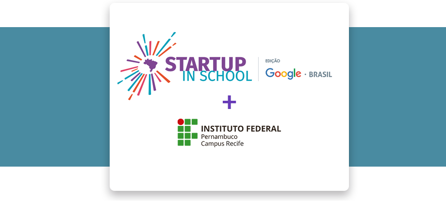

# Startup In School Google Brasil

O programa de empreendedorismo Startup In School Google Brasil, promovido no IFPE, realizou a oficina de Desenvolvido de Aplicativo onde foi desenvolvido um app para Android utilizando o App Inventor .

## Sobre o App Inventor 

Também conhecido como MIT App Inventor, é uma aplicação código aberto originalmente criada pela Google, e atualmente mantida pelo Massachusetts Institute of Technology. 

Você pode conhecer mais do projeto clicando [aqui!](https://appinventor.mit.edu/)

## Aplicativo de rádio
