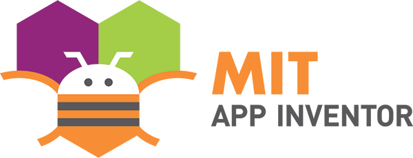
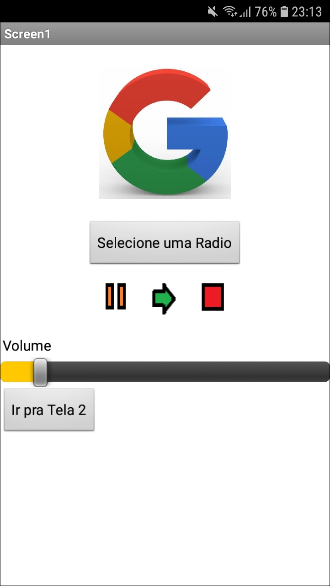
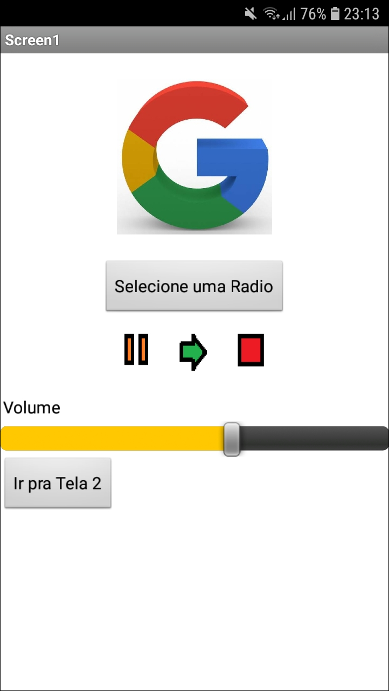

# Startup In School Google Brasil

O programa de empreendedorismo Startup In School Google Brasil, promovido no IFPE, realizou a <b>Oficina de Desenvolvido de Aplicativo</b> onde foi desenvolvido um app para Android utilizando a ferramenta App Inventor .

## Sobre o App Inventor 

Também conhecido como MIT App Inventor, é uma aplicação open source originalmente criada pela Google e atualmente mantida pelo Massachusetts Institute of Technology (MIT). 

Você pode conhecer mais do projeto clicando [aqui!](https://appinventor.mit.edu/)

## Aplicativo de rádio

O foco da oficina foi apresentar a feramenta e seus elementos para que fosse possível desenvolver um app de rádio, não se preocupando com seu design e sim com a didática e a comprensão da lógica de programação por parte dos participantes. 

 
